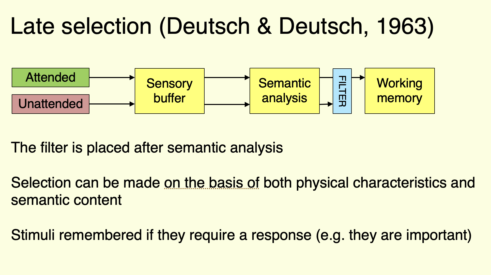
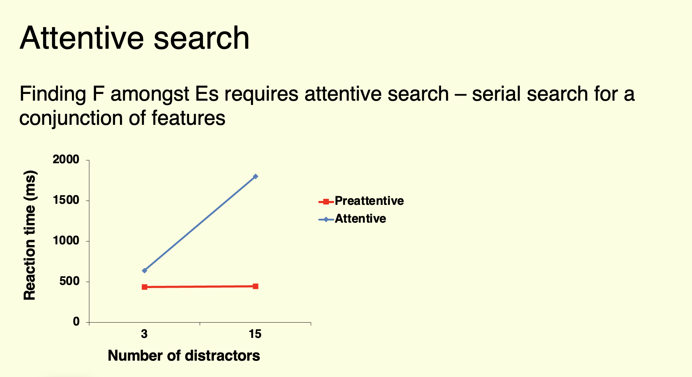

# Overview

Albert Einstein is quoted as saying:

> "If you can't explain it simply, you don't understand it well enough"

And it's true that explaining a concept to someone else is a great way to consolidate your understanding of it.

In this task, we practice explaining a concept from a lecture to a friend, as if you were leaving them a voice note. 

# Instructions

::: instruction

1.  Choose ONE of the slides from below (both are from Peter Jones' lecture on Selective Attention).

2.  Go to the lecture and listen carefully

3.  *Without* any of the other slides in front of you, imagine explaining it to a friend in a WhatsApp-style voice-note (see how to record below).

:::

# Slides to explain

Choose one of the following slides.

Slide 1: Late selection model

<!-- 
Example of a description

This slide illustrates the "Late Selection" model proposed by Deutsch and Deutsch in 1963. According to this model, all incoming stimuli—whether attended to or not—undergo sensory processing and semantic analysis. The filtering of information happens only after semantic analysis, meaning selection occurs based on the meaning (or semantics) of the information rather than just physical properties (such as volume or pitch). Information is remembered if it is deemed important, especially if a response is required. The model contrasts with earlier theories where filtering was believed to happen earlier in the perceptual process. 

-->

Slide 2: Attentive search

<!--

EXAMPLE DESCRIPTION

This slide illustrates two types of visual search tasks:

Finding a red circle among blue circles (a task of preattentive search).
Finding the letter F among E’s (a task of attentive search).
The graph compares the reaction times for these two tasks as the number of distractors (irrelevant items) increases.

For the first task, finding a red circle among blue circles relies on preattentive search. This type of search is fast and automatic because the red circle has a distinct feature (color) that makes it "pop out" immediately from the blue distractors. The red line on the graph shows that the reaction time for this task remains constant, even as the number of distractors increases. This indicates that the brain processes the red circle effortlessly without needing to scan each item individually.

In contrast, the second task, finding the letter "F" among "E"s, requires attentive search. Since "F" and "E" share many visual features, they cannot be easily distinguished by a simple feature like color or shape. Instead, participants must carefully scan each letter to find the "F," making it a more effortful, serial process. The blue line on the graph shows that as the number of distractors increases, the reaction time also increases, indicating that the search becomes more difficult and takes longer with more "E"s present.

In summary:

Preattentive search (finding a red circle) is quick, automatic, and not affected by the number of distractors.
Attentive search (finding an "F" among "E"s) is slower, requires focused attention, and becomes more time-consuming as the number of distractors increases.
This distinction highlights how different types of searches place different cognitive demands on visual processing.

-->

# Recording your work

Record your "voice note" using

-   the "Voice Memos" app on iPhone, or
-   the "Voice Recorder" app on Android

Don't use WhatsApp because it's harder to upload later.

[Upload your recording here](https://psybot.llemma.net/add/){.submit-work .btn .btn-primary}

When you add your practice, upload an audio file of your voice note. PsyBot will listen to the audio and give you feedback.

# YOUR TASK NOW

The student has been asked to complete this task for one of the slides.
They have uploaded their work. You need to provide feedback

## THE STUDENT'S WORK

{source}

## GIVE FEEDBACK

Use the information above, and the example relevant to the slide they chose.

Give a short paragraph of feedback. Be encouraging and specific about what they did well and what they could improve. If their text doesn't
seem to relate to the task, apologise and say there may have 
been a misunderstanding but you can't give feedback. Try to give feedback on their verbal explanation if you can.

